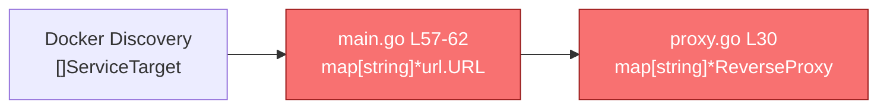
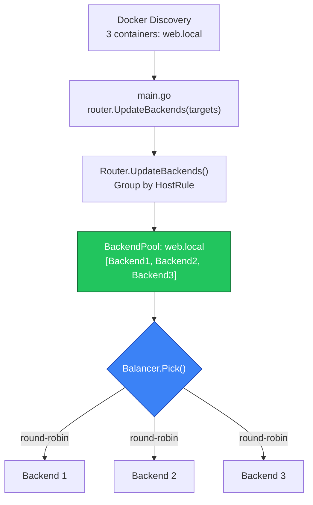

# Milestone 1.1 — Multi-Replica Load Balancing

## Goal

Replace the current 1:1 host→backend proxy mapping with a **BackendPool** that supports multiple container replicas per hostname, distributable via selectable load balancing algorithms (`round-robin`, `least-conn`, `random`, `ip-hash`).

After this change, running `docker compose up --scale web=3` will distribute traffic across all 3 replicas instead of silently overwriting to a single one.

## Systematic Debugging — Root Cause Analysis

### Where it breaks today



1. **Discovery** correctly returns multiple `ServiceTarget` with the same `HostRule` (e.g. 3 containers all labelled `traffic-proxy.rule=web.local`).
2. **[main.go L57-62](file:///C:/Users/johan/Desktop/Traffic-Proxy-Dashboard/cmd/proxy/main.go#L57-L62)**: Builds `map[string]*url.URL` keyed by `HostRule` → **last container wins**, earlier replicas silently overwritten.
3. **[proxy.go L30](file:///C:/Users/johan/Desktop/Traffic-Proxy-Dashboard/internal/proxy/proxy.go#L30)**: `backends map[string]*httputil.ReverseProxy` stores exactly one proxy per host → structurally cannot hold replicas.

### Fix strategy

Replace the flat map with a `BackendPool` per host rule, where each pool holds N reverse proxies and selects one per request using a configurable algorithm.

---

## User Review Required

> [!IMPORTANT]
> **New Docker label**: `traffic-proxy.balance` (values: `round-robin`, `least-conn`, `random`, `ip-hash`; default: `round-robin`). This label is read from container labels and stored in `ServiceTarget`. Existing containers without this label will automatically use round-robin.

> [!IMPORTANT]
> **Breaking change to `Router.UpdateBackends()`**: The current signature `UpdateBackends(routes map[string]*url.URL)` will be replaced with `UpdateBackends(targets []discovery.ServiceTarget)` since we now need multiple URLs per host rule plus the balance algorithm label. The only caller is [main.go L63](file:///C:/Users/johan/Desktop/Traffic-Proxy-Dashboard/cmd/proxy/main.go#L63).

---

## Proposed Changes

### Component 1: Load Balancer Algorithms

#### [NEW] `internal/proxy/balancer.go`

**Purpose**: Defines the `Balancer` interface and 4 algorithm implementations. Keeps load balancing logic isolated from routing logic.

```go
package proxy

type Balancer interface {
    Pick(backends []*Backend, clientIP string) *Backend
}
```

**4 algorithms:**

| Algorithm | How it picks | Use case |
|-----------|-------------|----------|
| `RoundRobin` | Atomic counter `% len(backends)` | Even distribution (default) |
| `LeastConn` | Picks backend with lowest `activeConns` atomic counter | Backends with variable response times |
| `Random` | `rand.Intn(len(backends))` | Simple stateless distribution |
| `IPHash` | `fnv32a(clientIP) % len(backends)` | Session stickiness without cookies |

Each backend tracks its own active connection count:

```go
type Backend struct {
    URL        *url.URL
    Proxy      *httputil.ReverseProxy
    ActiveConns atomic.Int64  // tracked per-backend for least-conn
    Healthy     bool
}
```

A factory function parses the label string:

```go
func NewBalancer(algorithm string) Balancer
// "round-robin" → &RoundRobin{}
// "least-conn"  → &LeastConn{}
// "random"      → &Random{}
// "ip-hash"     → &IPHash{}
// default/empty → &RoundRobin{}
```

---

### Component 2: Backend Pool

#### [MODIFY] `internal/proxy/proxy.go`

**Purpose**: Replace the flat `map[string]*httputil.ReverseProxy` with `map[string]*BackendPool`. Each pool holds N backends and a balancer.

**What changes:**

| Current | After |
|---------|-------|
| `backends map[string]*httputil.ReverseProxy` | `pools map[string]*BackendPool` |
| `RegisterBackend(host, url)` — stores 1 proxy | `RegisterBackend(host, url)` — adds to pool (backward compat) |
| `UpdateBackends(map[string]*url.URL)` — 1:1 map | `UpdateBackends([]ServiceTarget)` — groups targets by host, builds pools |
| `ServeHTTP` — direct map lookup | `ServeHTTP` — pool lookup → balancer picks backend |
| `Backends() []string` — returns host keys | `Backends() []string` — unchanged interface |

**New `BackendPool` struct** (defined in this file):

```go
type BackendPool struct {
    backends []*Backend
    balancer Balancer
    mu       sync.RWMutex
}
```

**`ServeHTTP` change** — the key routing change:

```go
// Before:
proxy, exists := r.backends[cleanHost]
proxy.ServeHTTP(w, req)

// After:
pool, exists := r.pools[cleanHost]
backend := pool.Pick(req.RemoteAddr)
if backend == nil {
    http.Error(w, "No healthy backend available", http.StatusBadGateway)
    return
}
backend.ActiveConns.Add(1)
defer backend.ActiveConns.Add(-1)
backend.Proxy.ServeHTTP(w, req)
```

**`UpdateBackends` change** — the subscription handler:

```go
// Before: map[string]*url.URL (1:1, last container wins)
// After:  []ServiceTarget → grouped by HostRule → BackendPool per group

func (r *Router) UpdateBackends(targets []discovery.ServiceTarget) {
    r.mu.Lock()
    defer r.mu.Unlock()

    grouped := map[string][]discovery.ServiceTarget{}
    for _, t := range targets {
        if t.Healthy && t.TargetURL != nil {
            host := NormalizeHost(t.HostRule)
            grouped[host] = append(grouped[host], t)
        }
    }

    newPools := make(map[string]*BackendPool, len(grouped))
    for host, targets := range grouped {
        algorithm := targets[0].Labels["traffic-proxy.balance"]
        backends := make([]*Backend, 0, len(targets))
        for _, t := range targets {
            backends = append(backends, &Backend{
                URL:     t.TargetURL,
                Proxy:   newReverseProxy(t.TargetURL),
                Healthy: t.Healthy,
            })
        }
        newPools[host] = &BackendPool{
            backends: backends,
            balancer: NewBalancer(algorithm),
        }
    }
    r.pools = newPools
}
```

**`Backends()` method** — returns same `[]string`, no caller changes needed.

**`RegisterBackend()` method** — kept for backward compatibility (tests, dev seeder). Adds a single-backend pool with round-robin.

---

### Component 3: Discovery — All-Containers Scan

#### [MODIFY] `internal/discovery/discovery.go`

**What changed** (breaking from previous label-gate design):

| Before | After |
|--------|-------|
| Skipped containers missing `traffic-proxy.enable=true` | **All running containers** are catalogued |
| Skipped containers missing `traffic-proxy.rule` | HostRule derived from container name when label absent |
| No reachability testing | 2-second TCP probe per container |
| No error surface for unreachable containers | `DiscoveryError` field with human-readable cause |
| No `Enabled` concept | `Enabled=true` for labelled containers; `false` for unlabelled (UI toggle ready) |

**New `ServiceTarget` fields:**

```go
type ServiceTarget struct {
    // ... existing fields unchanged ...
    DiscoveryError string // non-empty when TCP probe fails — never silently dropped
    Reachable      bool   // result of 2-second TCP dial
    Enabled        bool   // true: label opt-in or traffic-proxy.rule present
                          // false: raw unlabelled container (future UI toggle)
}
```

**Host rule derivation logic:**

```
if traffic-proxy.rule label present  → use label value (explicit)
else                                 → use container name, strip leading "/"
```

**Enabled logic:**

```
traffic-proxy.enable=true  OR  traffic-proxy.rule label present  →  Enabled = true
no labels at all                                                  →  Enabled = false
```

**TCP probe** (`probeReachable`):

```go
// 2-second deadline, non-blocking relative to the poll interval.
// On failure: Reachable=false, DiscoveryError="unreachable (IP:port): <err>"
// On success: Reachable=true, DiscoveryError=""
// Container is always added to the catalogue — never dropped.
func probeReachable(ctx context.Context, host string, port int) (bool, error)
```

> [!NOTE]
> The proxy routing table (`UpdateBackends`) already filters on `Healthy && Reachable` before adding a container as an active backend, so unreachable containers catalogued by discovery do not receive traffic.

> [!IMPORTANT]
> **Frontend TODO (next milestone)**: The `Enabled` field is the hook for the user-facing toggle. The UI will show all containers, and toggling a container will flip `Enabled` and call a new API endpoint that updates the in-memory inclusion list. Discovery will continue scanning everything; the proxy will only route to `Enabled && Reachable` targets.

---

### Component 4: Subscription Handler

#### [MODIFY] `cmd/proxy/main.go`

**Purpose**: Change the subscription goroutine to pass the raw `[]ServiceTarget` to `UpdateBackends()` instead of flattening to `map[string]*url.URL`.

```go
// Before (L56-63):
case targets := <-sub:
    routes := make(map[string]*url.URL, len(targets))
    for _, target := range targets {
        if target.Healthy && target.TargetURL != nil {
            routes[target.HostRule] = target.TargetURL  // OVERWRITES!
        }
    }
    router.UpdateBackends(routes)

// After:
case targets := <-sub:
    router.UpdateBackends(targets)  // Grouping now handled inside Router
    // Count healthy for logging
    healthy := 0
    for _, t := range targets {
        if t.Healthy { healthy++ }
    }
    slog.Info("Proxy backends updated",
        "discovered_count", len(targets),
        "active_hosts", len(router.Backends()),
        "healthy", healthy)
```

This is a **3-line simplification** — the complexity moves into `Router.UpdateBackends()` where it belongs.

---

### Component 5: Dev Endpoints

#### [MODIFY] `internal/server/dev.go`

**Purpose**: `handleDevDebugState` currently calls `proxyRouter.Backends()` which returns `[]string` — this still works unchanged since `Backends()` keeps the same signature.

No changes needed.

---

### Component 6: SSE Telemetry

#### [MODIFY] `internal/server/server.go`

**Purpose**: The SSE stream currently shows `discovered_services` count. We should also show the total backend replica count for visibility.

**Minimal change**: Add `TotalBackends` to the `MetricSnapshot` so the dashboard can show "3 hosts / 7 replicas" instead of just "3 services".

```go
// In sendSnapshot(), after getting services:
snapshot := collector.Snapshot(serviceCount, healthyCount)
```

> [!NOTE]
> This is optional for the initial implementation. The SSE stream will continue to work as-is since it reads from `dockerProvider.Services()` which already returns all replicas. The `discovered_services` count will correctly show total containers, not unique hosts.

---

### Component 7: Unit Tests

#### [MODIFY] `test/unit/proxy_test.go`

**Purpose**: Add new tests for multi-replica load balancing. Update existing tests to work with the new pool-based internals.

**New tests:**

| Test | What it verifies |
|------|-----------------|
| `TestBackendPool_RoundRobin` | 3 backends, 9 requests → each gets exactly 3 |
| `TestBackendPool_Random` | 3 backends, 100 requests → all 3 receive at least 1 |
| `TestBackendPool_IPHash` | Same IP always routes to same backend |
| `TestBackendPool_LeastConn` | Requests route to backend with lowest active connections |
| `TestRouter_MultiReplica` | `RegisterBackend` same host 3x → traffic distributed |
| `TestRouter_UpdateBackends_MultiReplica` | Multiple `ServiceTarget` with same `HostRule` → pool created |

**Existing tests** (`TestRouter_ServeHTTP_Routing`, `TestRouter_UpdateBackends`, `TestRouter_QueueTimeout`): These use `RegisterBackend(host, url)` which remains backward compatible — no changes needed.

#### [NEW] `test/unit/balancer_test.go`

**Purpose**: Isolated tests for each balancer algorithm to verify correctness independently from the router.

---

### Component 8: Documentation

#### [MODIFY] `MILESTONES.md`

**Purpose**: Check off Milestone 1.1 and document the implementation.

#### [MODIFY] `README.md`

**Purpose**: Document the new `traffic-proxy.balance` label in the Docker labels reference section.

---

## Data Flow — After



---

## File Change Summary

| File | Action | Purpose |
|------|--------|---------| 
| [`internal/proxy/balancer.go`](file:///home/ninonakano/Desktop/Traffic-Proxy-Dashboard/internal/proxy/balancer.go) | **NEW** | 4 load balancing algorithms + `Backend` struct |
| [`internal/proxy/proxy.go`](file:///home/ninonakano/Desktop/Traffic-Proxy-Dashboard/internal/proxy/proxy.go) | **MODIFY** | Replace flat map with `BackendPool` map, update `ServeHTTP` and `UpdateBackends` |
| [`internal/discovery/discovery.go`](file:///home/ninonakano/Desktop/Traffic-Proxy-Dashboard/internal/discovery/discovery.go) | **MODIFY** | All-containers scan, TCP probe, `Reachable`/`Enabled`/`DiscoveryError` fields, host rule derivation from name |
| [`cmd/proxy/main.go`](file:///home/ninonakano/Desktop/Traffic-Proxy-Dashboard/cmd/proxy/main.go) | **MODIFY** | Pass raw `[]ServiceTarget` instead of flattened map |
| [`test/unit/discovery_test.go`](file:///home/ninonakano/Desktop/Traffic-Proxy-Dashboard/test/unit/discovery_test.go) | **MODIFY** | Updated fixture: 5 containers incl. unlabelled; assertions for `Enabled`, `HostRule` derivation, `DiscoveryError` |
| [`test/unit/proxy_test.go`](file:///home/ninonakano/Desktop/Traffic-Proxy-Dashboard/test/unit/proxy_test.go) | **MODIFY** | Add multi-replica and pool distribution tests |
| [`test/unit/balancer_test.go`](file:///home/ninonakano/Desktop/Traffic-Proxy-Dashboard/test/unit/balancer_test.go) | **NEW** | Isolated algorithm correctness tests |
| [`MILESTONES.md`](file:///home/ninonakano/Desktop/Traffic-Proxy-Dashboard/MILESTONES.md) | **MODIFY** | Check off 1.1, document implementation |
| [`README.md`](file:///home/ninonakano/Desktop/Traffic-Proxy-Dashboard/README.md) | **MODIFY** | Document `traffic-proxy.balance` label |

**No changes needed:**
- `internal/server/dev.go` — `Backends()` signature unchanged
- `internal/server/server.go` — SSE reads from discovery, not proxy
- `internal/metrics/metrics.go` — no structural changes
- `internal/config/config.go` — no new env vars needed

---

## Verification Plan

### Automated Tests

```powershell
# Run all unit tests with verbose output
go test -v ./...

# Run only balancer-specific tests
go test -v -run "TestBackendPool|TestRouter_MultiReplica|TestBalancer" ./test/unit/

# Run linter to verify no formatting or static analysis issues
golangci-lint run --timeout 5m

# Run go vet
go vet ./...

# Verify binary compiles
go build -o "$env:TEMP\proxy-verify.exe" ./cmd/proxy
```

### Manual Verification

1. **Build and run** with `ENVIRONMENT=DEVELOPMENT`:
   ```powershell
   .\start.ps1
   ```

2. **Open dashboard** at `http://localhost` and confirm the Overview tab loads.

3. **Dev Tools seeder**: Click "Seed Traffic" in Dev Tools tab — should show traffic being distributed (visible in the seed result `sampled_hosts`).

4. **Docker scaling** (when Docker Desktop is running):
   ```bash
   docker compose up --scale web=3
   ```
   Confirm 3 replicas appear in Routes & Discovery tab and traffic distributes across all 3.
